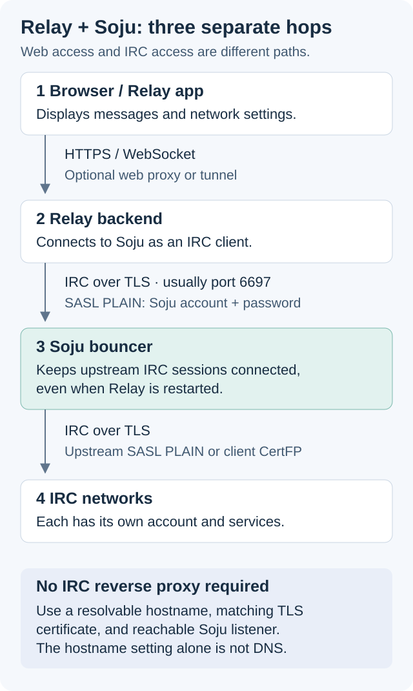
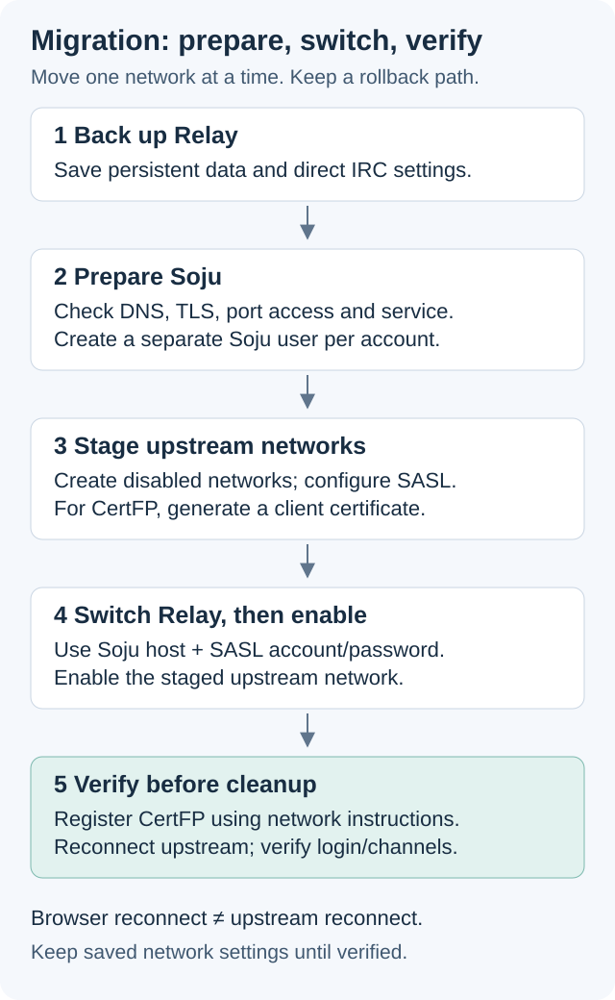

# Relay + Soju Runbook

Operational documentation for running [Relay](https://relayirc.com), a web IRC client, with [Soju](https://soju.im/) as a persistent IRC bouncer.

This runbook is intended for self-hosted deployments where Soju maintains the upstream IRC connections and Relay connects to Soju as an IRC client.

## Use it with your client and distribution

Relay is the example client because it is convenient for this setup, not because Soju requires it. The same approach applies to other compatible IRC clients: connect to Soju using its hostname, TLS port, and bouncer credentials. Field names and authentication options vary by client. A desktop or terminal IRC client normally connects directly to Soju, without Relay's browser/backend layers shown below.

The setup is not limited to Debian/Ubuntu. The general approach applies across Linux distributions where Soju is available. The commands here use Debian/Ubuntu packages and systemd; adapt package names, paths, service management, firewall rules, and certificate-renewal scheduling for your distribution. Other distributions have not been tested by this runbook.

## What this covers

- Installing and configuring Soju on Debian/Ubuntu.
- Private/VPN-reachable IRC access.
- Let's Encrypt certificates using DNS-01 validation.
- Automatic certificate renewal and Soju TLS reloads.
- Upstream SASL PLAIN and CertFP/SASL EXTERNAL authentication.
- Migrating existing Relay networks to Soju.
- Multiple Relay accounts and persistent channel connections.
- Common administration, verification, rollback, and troubleshooting commands.

## Documents

Read these in order:

1. [Relay + Soju setup and migration guide](relay-soju-setup-and-migration.md) — complete installation and migration procedure.
2. [Soju administration cheat sheet](soju-admin-cheatsheet.md) — day-to-day commands, helper functions, and troubleshooting.

For a terminal client instead of (or alongside) Relay, see [WeeChat + Soju](weechat-soju.md). It covers client setup without repeating the bouncer installation steps.

## Optional administration interface

Prefer menus to command-line administration? [Soju-TUI](https://github.com/variablenix/soju-tui) is an optional terminal interface for managing Soju users, networks, channels, SASL, and certificates through `sojuctl`. It requires a running Soju instance and authorized access to its admin socket. Follow its README for installation and access setup.

Soju-TUI is not an IRC chat client or a replacement for Soju, and it does not need to stay open to keep IRC connections alive. All administration in this runbook can still be performed with `sojuctl` without installing it.

## High-level architecture

Soju handles native IRC over TLS itself: no reverse proxy is required between Relay's backend and Soju. The connection hostname must resolve to the server, the TLS certificate must match it, and the listener port must be reachable. Soju's `hostname` setting does not create DNS records or open ports. An existing wildcard or private DNS record can provide resolution.

An HTTP proxy or Cloudflare Tunnel serving Relay's web interface is a separate connection, not the IRC connection to Soju.

The important separation is:

- Relay authenticates to Soju with the Soju account and password.
- Soju authenticates to each IRC network with upstream SASL credentials or its own registered client certificate.

## Migration principle

Keep the existing Relay data and networks until the Soju connection is verified. Prepare Soju first, edit each Relay network in place, save once, then verify the upstream account and channels.

After migration, restarting only Relay should reconnect the Relay client to Soju without making the upstream IRC network see a quit/part. Soju must remain running as its separate systemd service.

## Security notes

The examples use placeholders. Before publishing or sharing this repository, confirm that it contains no:

- IRC or Soju passwords.
- API tokens or private keys.
- Private IP addresses or internal hostnames.
- Personal nicknames, account names, or certificate fingerprints.

Keep Soju's administrative socket private, restrict TCP/6697 to trusted clients, and avoid enabling debug logging during normal operation.

## Status

This is an operational runbook, not a turnkey installer. Review provider-specific DNS plugin options, IRC network authentication requirements, and local firewall/DNS behavior before applying commands.

Examples target a Debian/Ubuntu systemd installation with Soju's native IRC/TLS listener. Package availability and commands vary by release; check the installed `man soju`, `man sojuctl`, and `sojuctl help`. No custom Soju fork or Soju-TUI installation is required. Soju-TUI is an optional administration interface, not the bouncer.
